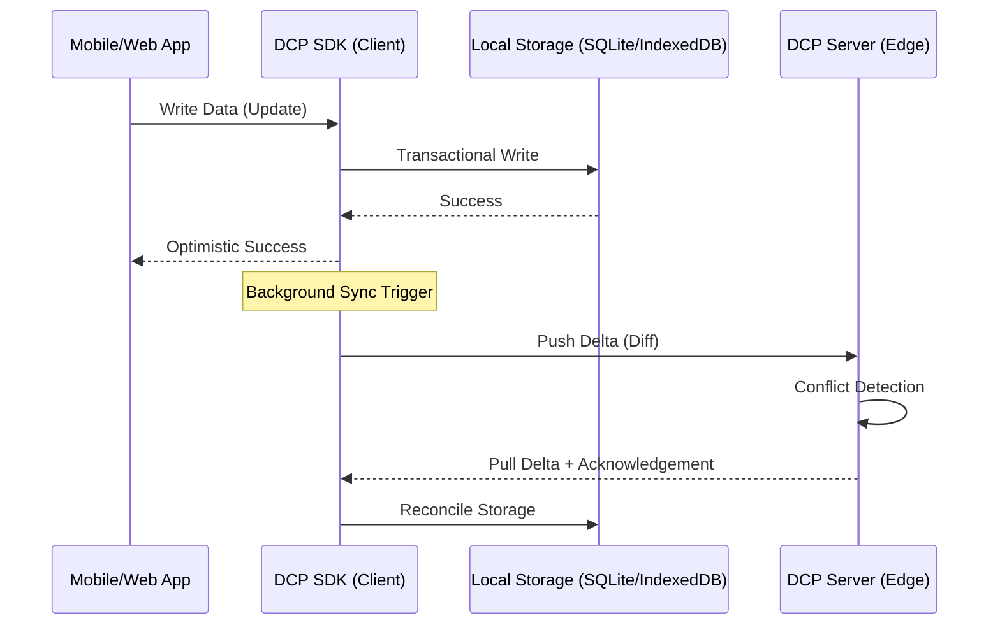
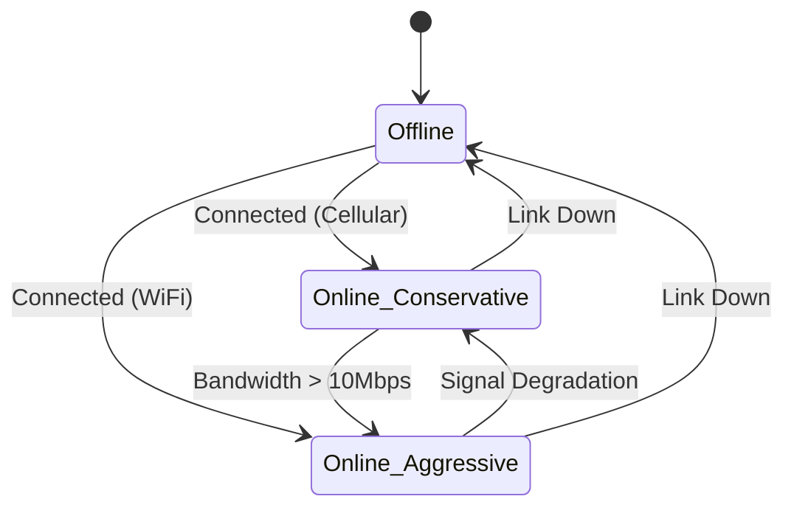

# DCP (Dart Connect Protocol) Technical Roadmap

## 1. Executive Summary
Dart Connect Protocol (DCP) is a mission-critical infrastructure designed to provide a "Network-Transparent" experience. Developed in Strict TypeScript, it abstracts the network layer, ensuring that mobile and web applications remain fully functional regardless of connectivity. By combining aggressive pre-fetching, differential synchronization, and local-first storage, DCP minimizes latency and eliminates the traditional dependency on constant API availability.

---

## 2. Architecture Design

### 2.1 Core Protocol Specifications
DCP follows a **Local-First, Cloud-Synced** architecture. The source of truth for the application is always the local instance of DCP.

- **Primary Stack**: TypeScript (Strict Mode)
- **Transport**: Adaptive (WebSocket, HTTP/3, WebRTC for P2P)
- **Data Format**: Binary (Protobuf) for efficiency, JSON for debug mode.

### 2.2 Core TypeScript Interfaces

```typescript
/**
 * Global Configuration for the DCP Engine
 */
export interface IDCPConfig {
  syncIntervalMs: number;
  storageQuotaMb: number;
  priorityLevel: 'PASSIVE' | 'ACTIVE' | 'AGGRESSIVE';
  retryStrategy: {
    maxRetries: number;
    initialDelayMs: number;
    backoffFactor: number;
  };
}

/**
 * The heartbeat of DCP - manages all local states and sync activities.
 */
export interface IDCPClient {
  readonly networkStatus: INetworkState;
  readonly storage: IStorageProvider;
  
  initialize(config: IDCPConfig): Promise<void>;
  syncNow(): Promise<SyncReport>;
  registerModel<T>(name: string, schema: DCPSchema): void;
}

/**
 * Representation of a synchronized data entity
 */
export interface IDCPDocument<T> {
  id: string;
  data: T;
  _metadata: {
    lastSyncedAt: Date;
    version: number; // For differential sync
    isDirty: boolean;
    hash: string;
  };
}
```

### 2.3 Data Synchronization & Offline-First Patterns
- **Repository Pattern**: All data access is wrapped in a DCP Repository that handles the "Local Read -> Network Sync" flow transparently.
- **Optimistic Updates**: UI updates immediately; DCP handles the eventual consistency in the background.

---

## 3. Network Layer Specifications

### 3.1 Network Detection & Assessment
Instead of checking `onLine`, DCP implements a `NetworkProb` service that measures:
- **Bandwidth**: Throughput tests during sync.
- **Latency**: Round-trip time (RTT) to the nearest DCP Edge Node.
- **Jitter**: Reliability of the connection.

### 3.2 Strategy Matrix
| Condition | Strategy | Action |
| :--- | :--- | :--- |
| **Excellent (WiFi)** | Full Sync | Pre-load P0, P1, and P2 resources. Check all versions. |
| **Good (LTE/5G)** | Selective Sync | Sync modified data. Pre-load P0 only. |
| **Poor (3G/Low Signal)** | Critical Only | Minimal metadata sync. No binary pre-loading. |
| **Offline** | Deferred | Enqueue all operations to Local Queue. |

### 3.3 Protocol Optimization
- **HTTP/3 (QUIC)**: Mandatory for mobile apps to prevent head-of-line blocking during network handovers (e.g., switching from WiFi to Cellular).
- **Differential Sync**: Only transfer the "diff" between the local hash and the server hash.

---

## 4. TypeScript Implementation Strategy

### 4.1 Layered SDK Architecture
1. **Core Runtime**: The engine that handles the event loop for sync.
2. **Adapters**: Target-specific storage (SQLite for Capacitor/React Native, IndexedDB for Web).
3. **Connectors**: Framework-specific hooks (e.g., `useDCPStore` for React).

### 4.2 Differential Sync Algorithm
```typescript
interface IDiffPayload {
  baseVersion: number;
  targetVersion: number;
  patches: Array<{
    path: string;
    op: 'add' | 'remove' | 'replace';
    value: any;
  }>;
}
```

### 4.3 Conflict Resolution
DCP supports three resolution modes:
1. **LWW (Last Write Wins)**: Default for simple non-critical metrics.
2. **Merge**: Automated merging for arrays and maps.
3. **Custom**: Delegate to a TypeScript resolver function for complex domain logic.

---

## 5. Resource Management

### 5.1 Smart Pre-fetching
DCP predicts next-step resources using a **Transition Probability Matrix** (Markov Chain based on user navigation history).

### 5.2 Storage Quota Management
- **L1 (Critical)**: Never evicted.
- **L2 (Recent)**: Evicted based on LRU if quota is 90% full.
- **L3 (Prefetch)**: Evicted first if space is needed for manual user actions.

---

## 6. Development Roadmap & Timeline

### Phase 1: Foundation (Weeks 1-6)
- Core DCP Engine implementation.
- Basic Storage Adapters (Localstorage/IndexedDB).
- Network State Monitor.
- **Milestone**: "Functional Hello World" with offline data persistence.

### Phase 2: Synchronization (Weeks 7-14)
- Differential Sync (Delta updates).
- Sync Queue with exponential backoff.
- Conflict detection.
- **Milestone**: Bi-directional sync between 2 devices and a server.

### Phase 3: Intelligence (Weeks 15-22)
- Network Quality Assessment.
- Predictive Pre-loading.
- Compression (Brotli/Zstandard).
- **Milestone**: Production-ready performance optimization.

### Phase 4: Integration (Weeks 23-30)
- SDKs for React, Vue, and Flutter.
- Security & Encryption implementation.
- P2P Sync (Experimental).
- **Milestone**: Full GA (General Availability).

---

## 7. Performance Metrics (KPIs)

- **Sync Time**: Targeting < 500ms for delta updates under 50KB.
- **Recovery Time**: Time to consistency after reconnecting (Goal: < 2s).
- **Storage Overhead**: Data footprint should not exceed 1.2x of raw data.

---

## 8. Architecture Diagrams

### 8.1 High-Level Sync Flow


### 8.2 Network State Machine


---

## 9. Integration & SDK Design

### 9.1 Developer Experience (DX)
The DCP SDK is designed to be "invisible." Common functions are wrapped to automatically handle offline queuing.

```typescript
// SDK Usage Example
import { dcp } from '@corp/dcp-sdk';

const MyComponent = () => {
  // Reactive subscription to locally-cached data
  const { data, loading } = dcp.useQuery('user-profile', { id: '123' });

  const handleUpdate = async (newData) => {
    // This is optimistically updated and queued for background sync
    await dcp.mutate('user-profile', { id: '123', ...newData });
  };
}
```

### 9.2 Framework Support
- **React**: Custom hooks and `Context`.
- **Vue**: Reactive `ref` wrappers.
- **Flutter**: Event-driven `Repository` patterns with `Stream` support.

---

## 10. Resource Requirements

### 10.1 Team Structure
- **Core Engineers (3)**: Senior TypeScript developers with knowledge of synchronization algorithms (CRDT, Vector Clocks).
- **Mobile/Platform Specialist (1)**: Expert in Capacitor/React Native and SQLite optimization.
- **Backend/Systems Engineer (1)**: Expert in Go/Node.js for high-throughput sync edge nodes and HTTP/3.

### 10.2 Expertise Required
- **Languages**: TypeScript (Expert), Rust/C++ (Optional, for storage engine optimization).
- **Concepts**: Eventual Consistency, CAP Theorem, Binary Serialization, Network Protocols (QUIC, WebSockets).

---

## 11. Potential Pitfalls & Mitigation

| Pitfall | Mitigation |
| :--- | :--- |
| **Clock Skew** | Use Server-side timestamps and Vector Clocks for relative ordering. |
| **Storage Exhaustion** | Strict quotas and priority-based eviction policies. |
| **Battery Drain** | Limit background sync frequency on cellular and low battery states. |

---

## 12. Recommended Tooling
- **TypeScript**: 5.x+ (Strict mode).
- **Vitest**: For comprehensive testing of sync scenarios.
- **Protobuf.js**: High-efficiency serialization.
- **Absurd-SQL**: For high-performance SQLite in the browser via WebWorkers.
